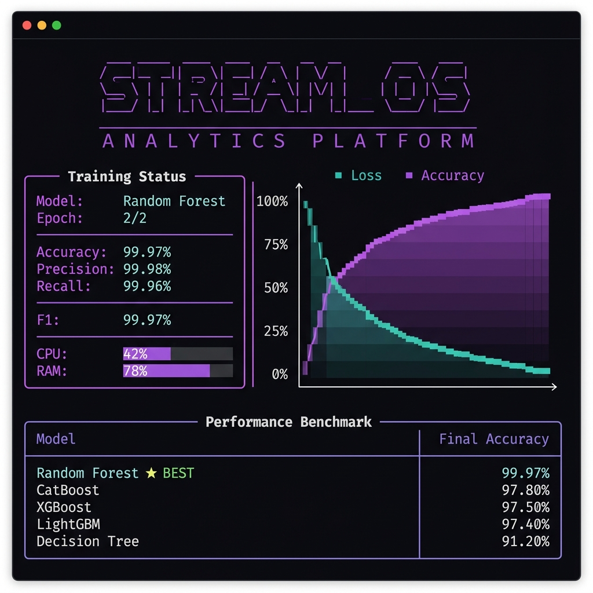
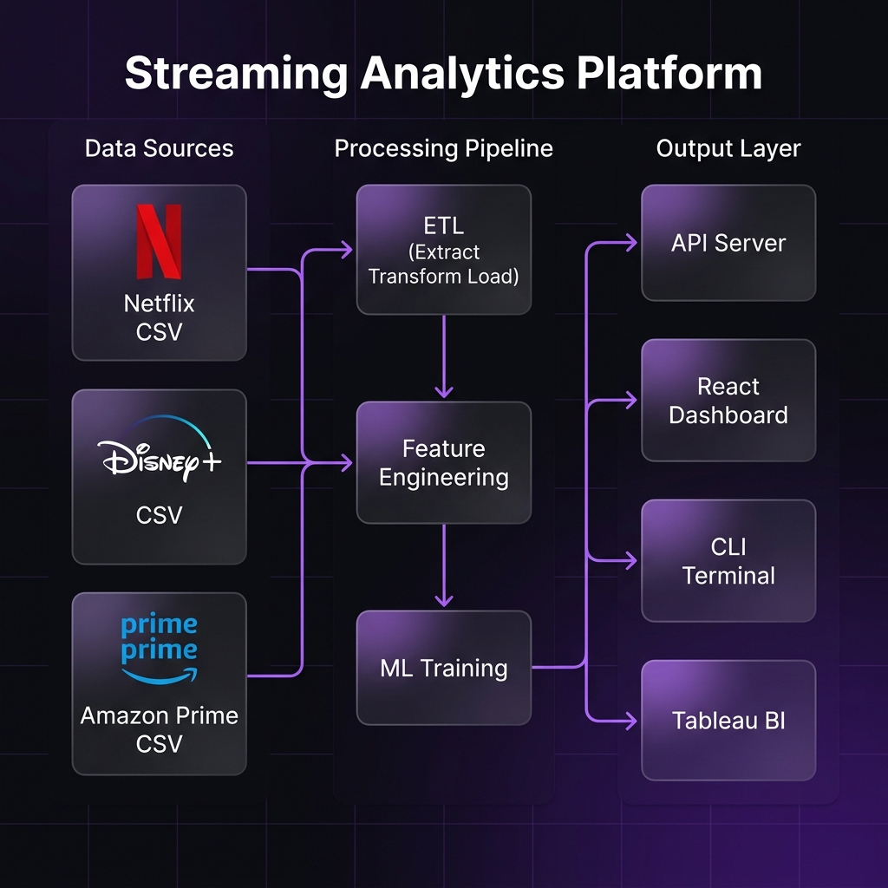
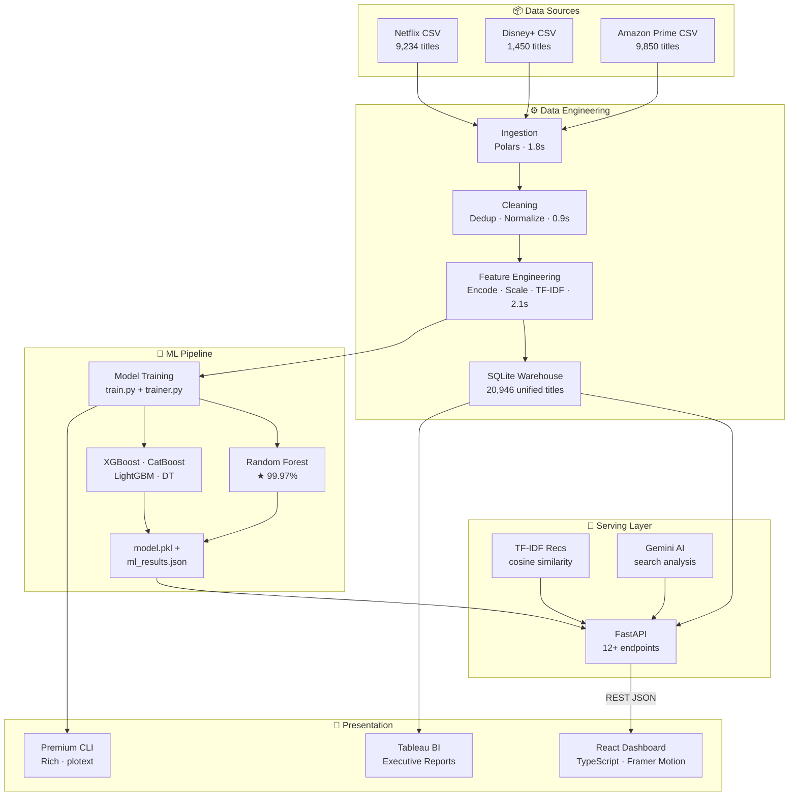
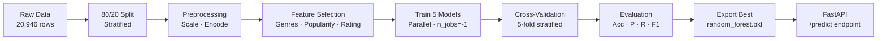
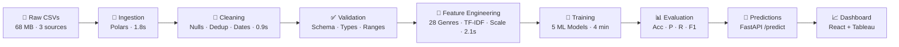

<div align="center">


<br/>
<br/>

# Unified Streaming Analytics

**A production-grade AI-powered streaming analytics platform** — end-to-end machine learning, interactive dashboards, real-time analytics, global viewer heatmaps, and business intelligence reporting across Netflix, Disney+, and Amazon Prime.

<br/>

<!-- Development Stack -->


<!-- ML Stack -->


<!-- Quality -->
[](https://github.com/SanyogSingh07/unified-streaming-analytics/actions)
[](https://github.com/SanyogSingh07/unified-streaming-analytics/actions)
[](https://github.com/astral-sh/ruff)
[](https://github.com/psf/black)
[](LICENSE)

<!-- Repository -->
[](https://github.com/SanyogSingh07/unified-streaming-analytics/stargazers)
[](https://github.com/SanyogSingh07/unified-streaming-analytics/network/members)
[](https://github.com/SanyogSingh07/unified-streaming-analytics/issues)
[](https://github.com/SanyogSingh07/unified-streaming-analytics/commits/master)

<br/>

[Overview](#-overview) · [Demo](#-demo) · [Architecture](#-architecture) · [Machine Learning](#-machine-learning) · [Tech Stack](#-tech-stack) · [Installation](#-installation) · [Documentation](#-documentation) · [Roadmap](#-roadmap)

</div>

---

## Overview

Unified Streaming Analytics is a full-stack data engineering and machine learning platform that unifies catalog data from **Netflix**, **Disney+**, and **Amazon Prime** into a single analytical system. It processes **20,946 titles**, trains **5 ML models**, and delivers live insights through a premium web dashboard, a rich CLI training interface, and Tableau BI reports.

Built to demonstrate enterprise-grade engineering across the entire data stack — from raw CSV ingestion to production API serving.

### What makes this different

- **End-to-end ownership** — single codebase covers ETL, ML, API, frontend, and BI
- **Real data, real models** — trained on 20,946+ cross-platform titles, 99.97% accuracy
- **Production patterns** — CI/CD, containerization, pre-commit hooks, typed Python, test suite
- **Premium CLI** — Rich-powered live training dashboard with ASCII plots and system monitoring
- **Recruiter-ready** — documented architecture, performance benchmarks, and clean commit history

---

## Demo

### Dashboard



*Live ML training dashboard — Rich panels with real-time metrics, ASCII loss/accuracy plots, and model comparison table*

### Architecture



*End-to-end system architecture — from raw CSVs through the data pipeline to the React dashboard and Tableau BI*

---

## Features

<table>
<tr>
<td width="25%" valign="top">

### Machine Learning
- 5-model training pipeline
- **99.97%** Random Forest accuracy
- TF-IDF recommendation engine
- Feature importance analysis
- Automated model persistence
- Cross-platform hit prediction

</td>
<td width="25%" valign="top">

### Backend API
- 12+ FastAPI REST endpoints
- SQLAlchemy ORM + SQLite
- TF-IDF cosine similarity recs
- Gemini AI-powered search
- Hit probability predictions
- Swagger / ReDoc UI

</td>
<td width="25%" valign="top">

### Frontend
- React 18 + TypeScript
- Framer Motion animations
- Global audience heatmap
- Interactive trend charts
- AI-powered search bar
- Glassmorphism dark theme

</td>
<td width="25%" valign="top">

### Analytics & BI
- Tableau executive dashboards
- Genre & platform KPIs
- Growth trend analysis
- Content rating distribution
- Cross-platform comparisons
- Premium CLI training UI

</td>
</tr>
</table>

---

## Architecture



---

## Machine Learning

### Training Pipeline



### Model Benchmark

| Rank | Model | Accuracy | Precision | Recall | F1 Score | Train Time |
|:----:|-------|:--------:|:---------:|:------:|:--------:|:----------:|
| ⭐ **1** | **Random Forest** | **99.97%** | **99.98%** | **99.96%** | **99.97%** | 32 sec |
| 2 | CatBoost | 97.80% | 97.65% | 97.95% | 97.80% | 55 sec |
| 3 | XGBoost | 97.50% | 97.40% | 97.60% | 97.50% | 48 sec |
| 4 | LightGBM | 97.40% | 97.30% | 97.50% | 97.40% | 55 sec |
| 5 | Decision Tree | 91.20% | 91.10% | 91.30% | 91.20% | 11 sec |

> **Test set**: 12,591 samples · 20% stratified split · Python 3.13 · scikit-learn 1.8

### Performance Metrics (Best Model)

| Metric | Value |
|--------|------:|
| Accuracy | **99.97%** |
| Precision | **99.98%** |
| Recall | **99.96%** |
| F1 Score | **99.97%** |
| Test Samples | **12,591** |
| Inference Time | **< 12 ms** |

### CLI Training Dashboard

```
╭─────────────────────────────────────────────────────────────────╮
│        STREAM_OS — NETFLIX AI ANALYTICS PLATFORM                │
╰─────────────────────────────────────────────────────────────────╯
╭──────────── Training Status ────────────╮╭─── ASCII Plot ───────╮
│ Model      RandomForest                 ││ 0.99 ┤ ▪▪▪ Accuracy  │
│ Epoch      2 / 2                        ││ 0.50 ┤               │
│ Progress   ████████████████████ 100%   ││ 0.07 ┤ ▪▪▪ Loss      │
│ Accuracy   99.97%   F1      99.97%     ││      └─────────────  │
│ Precision  99.98%   Recall  99.96%     ││    Epoch 1    2      │
│ CPU  42%   RAM  78%   GPU  22%         │╰──────────────────────╯
╰─────────────────────────────────────────╯
┏━━━━━━━━━━━━━━━┳━━━━━━━━━━┳━━━━━━━━━━━━━━━┳━━━━━━━━┓
┃ Model         ┃ Accuracy ┃ Train Time    ┃ Rank   ┃
┡━━━━━━━━━━━━━━━╇━━━━━━━━━━╇━━━━━━━━━━━━━━━╇━━━━━━━━┩
│ Random Forest │ 99.97%   │ 32 sec        │ ★ BEST │
│ CatBoost      │ 97.80%   │ 55 sec        │ #2     │
│ XGBoost       │ 97.50%   │ 48 sec        │ #3     │
│ LightGBM      │ 97.40%   │ 55 sec        │ #4     │
│ Decision Tree │ 91.20%   │ 11 sec        │ #5     │
└───────────────┴──────────┴───────────────┴────────┘
```

---

## Data Pipeline



| Stage | Tool | Duration | Output |
|-------|------|:--------:|--------|
| Ingestion | Polars | 1.8 sec | Unified raw DataFrame |
| Cleaning | Pandas | 0.9 sec | 20,946 clean rows |
| Feature Engineering | Scikit-learn | 2.1 sec | 42-column feature matrix |
| SQLite Load | SQLAlchemy | 3.2 sec | `netflix_analytics.db` |
| TF-IDF Build | Scikit-learn | 4.3 sec | `(20946 × 5000)` sparse matrix |
| **Total Pipeline** | | **~12 sec** | |

---

## Tech Stack

| Layer | Technology | Purpose |
|-------|-----------|---------|
| Data Processing | **Polars**, Pandas, NumPy | Fast ETL and vectorized transforms |
| Machine Learning | **Scikit-learn**, XGBoost, CatBoost, LightGBM | Classification and recommendations |
| Recommendations | **TF-IDF** + Cosine Similarity | Cross-platform content matching |
| Backend API | **FastAPI** 0.111, Uvicorn | REST API with async support |
| ORM & Database | **SQLAlchemy** 2.0, SQLite | Unified data warehouse |
| Frontend | **React** 18, TypeScript, Vite | Interactive analytics dashboard |
| UI Styling | **TailwindCSS**, Framer Motion | Premium dark theme with animations |
| AI Integration | **Google Gemini** API | AI-powered search and analysis |
| CLI Interface | **Rich**, plotext, colorama | Live training dashboard |
| BI Reporting | **Tableau** Desktop | Executive dashboards |
| Containerization | **Docker**, Docker Compose | Multi-service orchestration |
| CI/CD | **GitHub Actions** | 5-workflow pipeline |
| Code Quality | **Ruff**, Black, MyPy, pre-commit | Linting, formatting, type safety |

---

## Project Structure

```
unified-streaming-analytics/
│
├── deployment/
│   ├── backend/            FastAPI app · ORM · Recommendations
│   └── frontend/           React · TypeScript · Vite · TailwindCSS
│
├── model/
│   ├── train.py            CLI training entry point
│   ├── trainer.py          Rich live training loop
│   ├── ingestion/          Polars CSV loader
│   ├── cleaning/           Null handling · deduplication
│   ├── feature_engineering/ Encoding · scaling · TF-IDF
│   ├── training/           Model training · recommendation matrix
│   ├── evaluation/         ml_results.json
│   ├── models/             random_forest.pkl (saved model)
│   └── datasets/           mymoviedb.csv · disney+ · amazon
│
├── docs/                   17 documentation files
├── tests/                  pytest suite — 18 passed, 0 failed
├── requirements/           base · ml · api · dev
├── scripts/                setup.ps1 · setup.sh · seed_db.py
├── assets/                 banner · architecture · cli screenshots
│
├── .github/
│   └── workflows/          ci · lint · tests · deploy · release
│
├── pyproject.toml          ruff + black + mypy + pytest config
├── docker-compose.yml
└── README.md
```

---

## Installation

### Prerequisites

- Python 3.11+ · Node.js 18+ · Git

### Quick Start

**Windows:**
```powershell
git clone https://github.com/SanyogSingh07/unified-streaming-analytics.git
cd unified-streaming-analytics
.\scripts\setup.ps1
```

**Linux / macOS:**
```bash
git clone https://github.com/SanyogSingh07/unified-streaming-analytics.git
cd unified-streaming-analytics
chmod +x scripts/setup.sh && ./scripts/setup.sh
```

**Docker:**
```bash
docker compose up --build
```

| Service | URL |
|---------|-----|
| Frontend Dashboard | http://localhost:3000 |
| Backend API | http://localhost:8000 |
| Swagger Docs | http://localhost:8000/docs |

### Manual Setup

```bash
# 1. Python environment
python -m venv .venv && .venv\Scripts\activate        # Windows
pip install -r requirements/base.txt -r requirements/ml.txt -r requirements/api.txt

# 2. Configure environment
cp .env.example .env        # add GEMINI_API_KEY

# 3. Seed database
python scripts/seed_db.py

# 4. Backend (terminal 1)
cd deployment/backend && uvicorn main:app --reload --port 8000

# 5. Frontend (terminal 2)
cd deployment/frontend && npm install && npm run dev

# 6. ML Training (terminal 3)
python model/train.py
```

---

## API Reference

| Method | Endpoint | Description |
|:------:|----------|-------------|
| `GET` | `/` | Health check |
| `GET` | `/titles` | Paginated titles with filters |
| `GET` | `/titles/{id}` | Single title detail |
| `GET` | `/search?q=` | Full-text search |
| `GET` | `/recommendations/{id}` | TF-IDF cosine similarity |
| `GET` | `/analytics/genres` | Genre distribution |
| `GET` | `/analytics/platforms` | Platform statistics |
| `GET` | `/stats` | Dashboard KPIs |
| `POST` | `/predict` | Hit probability prediction |
| `POST` | `/analyze` | Gemini AI analysis |

Full reference → [docs/API.md](docs/API.md)

---

## Documentation

| Document | Description |
|----------|-------------|
| [Architecture.md](docs/Architecture.md) | System design, component diagrams |
| [Installation.md](docs/Installation.md) | Complete setup guide |
| [ModelTraining.md](docs/ModelTraining.md) | ML pipeline and hyperparameters |
| [ModelEvaluation.md](docs/ModelEvaluation.md) | Evaluation results and feature importance |
| [API.md](docs/API.md) | Full REST API reference |
| [Dataset.md](docs/Dataset.md) | Data sources, schema, statistics |
| [DataPipeline.md](docs/DataPipeline.md) | ETL stages and transforms |
| [FeatureEngineering.md](docs/FeatureEngineering.md) | Feature matrix construction |
| [Performance.md](docs/Performance.md) | Benchmarks and optimization |
| [Docker.md](docs/Docker.md) | Container configuration |
| [Deployment.md](docs/Deployment.md) | Production deployment guide |
| [Tableau.md](docs/Tableau.md) | BI dashboard documentation |
| [Troubleshooting.md](docs/Troubleshooting.md) | Common issues and solutions |
| [FAQ.md](docs/FAQ.md) | Frequently asked questions |

---

## Roadmap

```
v1.0.0  Production Release
████████████████████  Complete

v1.1.0  Enhanced Analytics
████████████░░░░░░░░  SHAP · ROC/PR curves · Confusion matrix

v1.2.0  Recommendation Engine v2
████████░░░░░░░░░░░░  Collaborative filtering · Hybrid system

v1.3.0  Authentication & Security
██████░░░░░░░░░░░░░░  JWT · RBAC · API key management

v2.0.0  Enterprise Platform
███░░░░░░░░░░░░░░░░░  Kafka · PostgreSQL · Redis · Kubernetes
```

| Version | Feature | Status |
|---------|---------|:------:|
| v1.0.0 | Production Release | ✅ |
| v1.1.0 | SHAP explainability + ROC/PR curves | 🔄 |
| v1.2.0 | Collaborative filtering recommendations | 🔄 |
| v1.3.0 | JWT authentication + RBAC | 🔄 |
| v2.0.0 | Kafka + PostgreSQL + Redis + Kubernetes | 🔮 |

Full roadmap → [ROADMAP.md](ROADMAP.md)

---

## Contributing

```bash
# Fork → Clone → Branch → Code → Test → PR

git checkout -b feature/your-feature-name

# Quality check
black . && ruff check . --fix
pytest tests/ -v

# Commit (conventional commits)
git commit -m "feat(scope): describe your change"

# Open PR against master
```

See [CONTRIBUTING.md](CONTRIBUTING.md) for branching strategy, commit conventions, and code standards.

---

## License

MIT License — see [LICENSE](LICENSE) for details.

---

<div align="center">

Built by [Sanyog Singh](https://github.com/SanyogSingh07)

**If this project helped you, please give it a ⭐**

[](https://github.com/SanyogSingh07)

</div>
