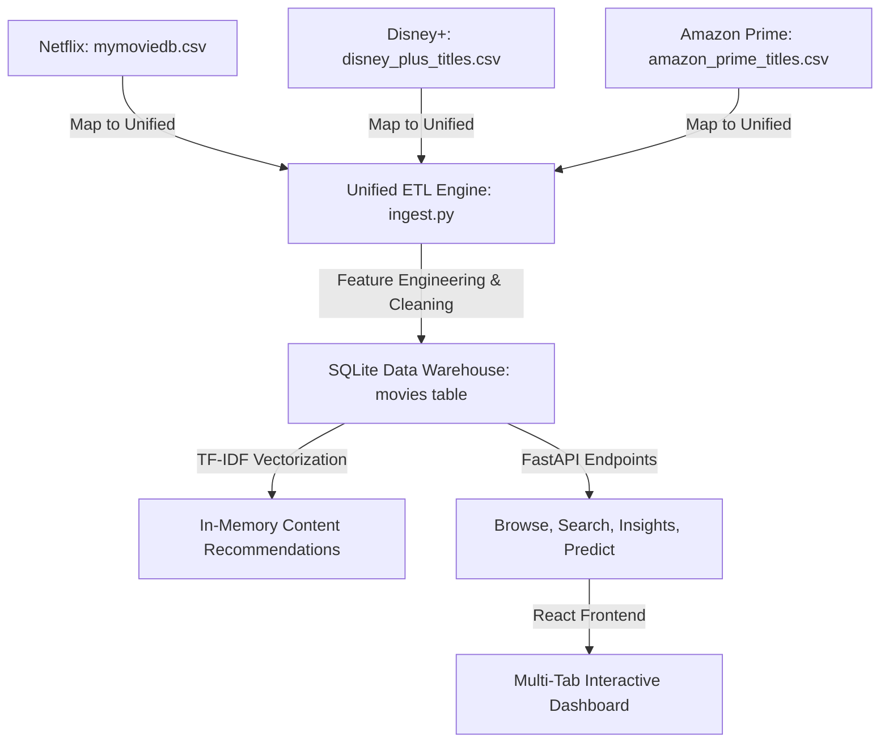

# Unified Streaming Platform Analytics

An enterprise-grade data engineering, machine learning, and interactive analytics application. It aggregates, cleans, and indexes catalog titles from multiple streaming providers (**Netflix**, **Disney+**, **Amazon Prime Video**) into a single unified SQLite database schema. It also features a responsive dark-themed React frontend with advanced ML recommendation engines and embedded analytics models.

---

## 1. Vision & Architecture

The platform aggregates, cleans, and indices catalog titles across Netflix, Disney+, and Amazon Prime into a structured SQLite data warehouse. The recommendation engine applies text-vectorization (TF-IDF) to query similar content cross-platform.



---

## 2. Unified Schema Design

The central `movies` table contains unified fields mapping across all three streaming providers:

| Attribute | Data Type | Source/Treatment | Description |
| :--- | :--- | :--- | :--- |
| `id` | `INTEGER` | Primary Key (Auto) | Unique row identifier |
| `platform` | `VARCHAR` | `'Netflix'` \| `'Disney+'` \| `'Amazon Prime'` | Source platform indicator |
| `type` | `VARCHAR` | `'Movie'` \| `'TV Show'` | Content classification |
| `title` | `VARCHAR` | Source text | Movie or show title |
| `release_date` | `VARCHAR` | Unified format (`YYYY-MM-DD`) | Release or additions date |
| `overview` | `TEXT` | Source description | Plot summary |
| `genres` | `VARCHAR` | Normalized tags | Comma-separated genre list |
| `director` | `VARCHAR` | Source text | Director name(s) |
| `cast` | `VARCHAR` | Source text | Main cast listing |
| `country` | `VARCHAR` | Source text | Production countries |
| `duration` | `VARCHAR` | Source text | Runtime in minutes or seasons |
| `rating` | `VARCHAR` | Source text | Content rating (e.g. TV-MA, PG-13) |
| `popularity` | `DOUBLE` | TMDB numeric (Netflix) \| `0.0` (Others) | Popularity metric |
| `vote_average` | `DOUBLE` | TMDB numeric (Netflix) \| `0.0` (Others) | Average rating |
| `vote_count` | `INTEGER` | TMDB numeric (Netflix) \| `0` (Others) | Review volume |

---

## 3. Data Science & ML Engine

* **Cross-Platform Recommendations**: The TF-IDF cosine-similarity engine indexes the combined `title + overview + genres` text corpus across **all 20,946 titles** in the SQLite database, enabling you to query recommendations from one platform and find content on another.
* **Sub-sampled Clustering & Forecasting**: K-Means clustering aggregates segments based on normalized ratings and popularity coordinates. Catalog volume forecasting projects release expansion per platform 10 years out.
* **Naive Bayes Quality Classification**: Learned parameters from Netflix ratings predict hit probabilities for Disney+ and Amazon Prime based on popularity and genre metadata.

---

## 4. Development Strategy & Streams

The project was developed in parallel across several streams:

* **Data Engineering**: Data acquisition, cleaning, schema mapping, and SQLite seeding (`ingest.py`).
* **Backend Services**: FastAPI web services providing search, predictions, statistics, and recommendations.
* **Frontend UI**: Responsive dark-themed executive dashboard implementing glassmorphism, Recharts, and Google Fonts (Hanken Grotesk, Inter, Geist).
* **Automated EDA**: Demonstrates advanced automated data profiling using notebooks and profiling HTML reports.

---

## 5. Technology Stack

* **Core**: React 18, Vite 5, Tailwind CSS, Lucide icons, Recharts
* **API & Database**: FastAPI, Uvicorn, SQLAlchemy, SQLite3
* **Analytics & ML**: Scikit-Learn, Pandas, NumPy, SweetViz, PyGWalker
* **DevOps**: Docker, Docker Compose, GitHub Actions CI/CD

---

## 6. Running the Project

### Running Frontend
```bash
cd frontend
npm run dev
```
Available at [http://localhost:3001/](http://localhost:3001/)

### Running Backend
```bash
cd backend
.venv\Scripts\uvicorn main:app --reload
```
Available at [http://localhost:8000/](http://localhost:8000/)
