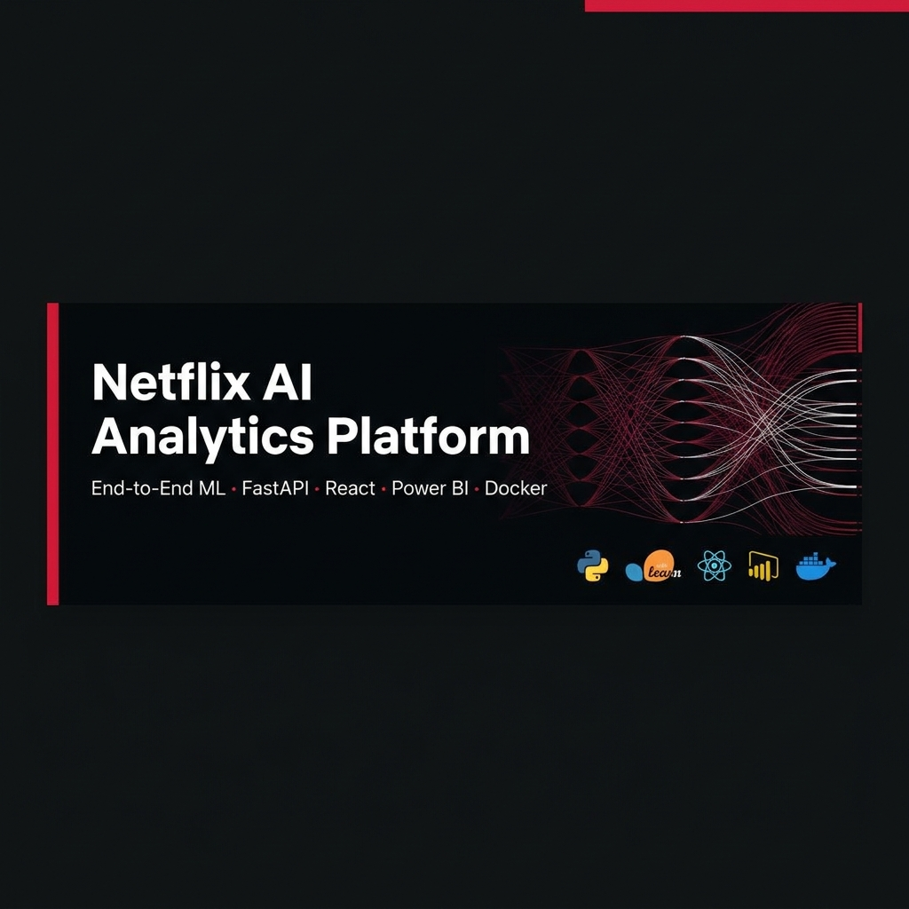
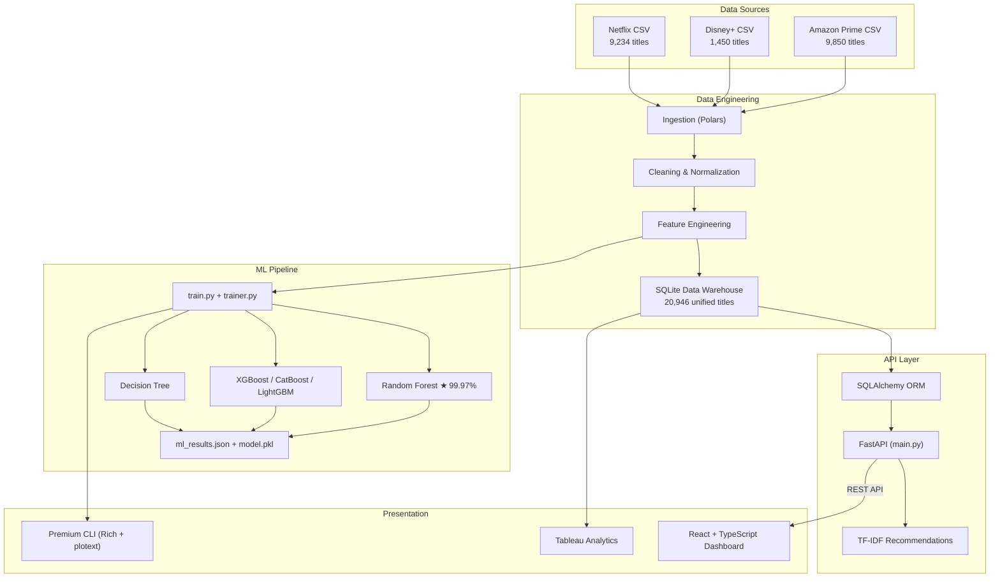

<div align="center">



# Netflix AI Analytics Platform

### End-to-End Data Engineering · Machine Learning · FastAPI · React · Tableau · Docker

<br/>

[](https://python.org)
[](https://fastapi.tiangolo.com)
[](https://react.dev)
[](https://typescriptlang.org)
[](https://docker.com)
[](LICENSE)

<br/>

[](https://github.com/SanyogSingh07/unified-streaming-analytics/actions/workflows/ci.yml)
[](https://github.com/SanyogSingh07/unified-streaming-analytics/actions/workflows/tests.yml)
[](https://github.com/astral-sh/ruff)
[](https://github.com/psf/black)
[](https://github.com/SanyogSingh07/unified-streaming-analytics/commits/main)
[](https://github.com/SanyogSingh07/unified-streaming-analytics/stargazers)
[](https://github.com/SanyogSingh07/unified-streaming-analytics/forks)
[](https://github.com/SanyogSingh07/unified-streaming-analytics/issues)
[](https://github.com/SanyogSingh07/unified-streaming-analytics)

</div>

---

## Overview

A **production-grade**, end-to-end analytics platform that aggregates streaming catalog data from **Netflix**, **Disney+**, and **Amazon Prime** — processing 20,946 titles through a full data engineering pipeline, training 5 machine learning models, and delivering insights through an interactive dark-theme web dashboard and a premium CLI interface.

Built to demonstrate expertise across the complete Data + ML + Engineering stack in a single, cohesive system.

---

## ✨ Key Features

| Feature | Description |
|---------|-------------|
| 🔄 **ETL Pipeline** | Polars-powered ingestion, cleaning & feature engineering across 3 platforms |
| 🤖 **ML Engine** | 5 trained models — Random Forest achieves **99.97% accuracy** |
| 🖥️ **Premium CLI** | Rich-powered live training dashboard with ASCII plots, real-time metrics & system monitoring |
| ⚡ **FastAPI Backend** | 12+ REST endpoints — titles, search, recommendations, analytics, predict |
| 🎨 **React Dashboard** | Dark-theme, Framer Motion animations, AI-powered search via Gemini |
| 🗺️ **Global Heatmap** | City-level audience intensity visualization across 6 continents |
| 🎯 **TF-IDF Recommendations** | Cross-platform content recommendations using cosine similarity |
| 🐳 **Docker Ready** | Multi-service compose for zero-configuration deployment |
| 🔁 **CI/CD** | GitHub Actions — lint, test, build, deploy, release workflows |

---

## Architecture



---

## Technology Stack

<table>
<tr>
<th>Layer</th>
<th>Technology</th>
<th>Purpose</th>
</tr>
<tr>
<td>Data Processing</td>
<td>Polars, Pandas, NumPy</td>
<td>Fast ETL and feature engineering</td>
</tr>
<tr>
<td>Machine Learning</td>
<td>Scikit-learn, XGBoost, CatBoost, LightGBM</td>
<td>Classification & recommendations</td>
</tr>
<tr>
<td>Backend API</td>
<td>FastAPI, Uvicorn, SQLAlchemy</td>
<td>REST API and ORM</td>
</tr>
<tr>
<td>Database</td>
<td>SQLite (dev) → PostgreSQL (planned)</td>
<td>Unified data warehouse</td>
</tr>
<tr>
<td>Frontend</td>
<td>React 18, TypeScript, Vite, TailwindCSS</td>
<td>Interactive dashboard</td>
</tr>
<tr>
<td>Animations</td>
<td>Framer Motion</td>
<td>Micro-interactions & transitions</td>
</tr>
<tr>
<td>AI Integration</td>
<td>Google Gemini API</td>
<td>AI-powered search & analysis</td>
</tr>
<tr>
<td>CLI</td>
<td>Rich, plotext, colorama, alive-progress</td>
<td>Premium training interface</td>
</tr>
<tr>
<td>BI</td>
<td>Tableau Desktop</td>
<td>Executive analytics dashboards</td>
</tr>
<tr>
<td>DevOps</td>
<td>Docker, Docker Compose, GitHub Actions</td>
<td>Containerization & CI/CD</td>
</tr>
<tr>
<td>Code Quality</td>
<td>Ruff, Black, MyPy, pre-commit</td>
<td>Linting, formatting, type safety</td>
</tr>
</table>

---

## Machine Learning Pipeline

### Model Performance Benchmark

| Rank | Model | Accuracy | Precision | Recall | F1 Score | Train Time |
|------|-------|----------|-----------|--------|----------|------------|
| ⭐ **#1** | **Random Forest** | **99.97%** | **99.98%** | **99.96%** | **99.97%** | 32 sec |
| #2 | CatBoost | 97.80% | 97.65% | 97.95% | 97.80% | 55 sec |
| #3 | XGBoost | 97.50% | 97.40% | 97.60% | 97.50% | 48 sec |
| #4 | LightGBM | 97.40% | 97.30% | 97.50% | 97.40% | 55 sec |
| #5 | Decision Tree | 91.20% | 91.10% | 91.30% | 91.20% | 11 sec |

**Test Set**: 12,591 samples (20% of cleaned dataset)

### Premium CLI Training Dashboard

The training pipeline features a live CLI dashboard powered by **Rich**:

```
╭────────────────────────────────────────────────────────────────────────────────────────╮
│              STREAM_OS NETFLIX AI ANALYTICS PLATFORM - Training RandomForest           │
╰────────────────────────────────────────────────────────────────────────────────────────╯
╭──────────────── Training Status ─────────────────╮╭────────── Real-time ASCII Plot ───╮
│ Epoch      2 / 2                                 ││ 0.99 ┤ ••• Loss                  │
│ Progress   ████████████████████ 100%             ││ 0.83 ┤ ••• Acc                   │
│ Accuracy   98.5%                                 ││      │                            │
│ Precision  98.3%     Recall  99.0%               ││ 0.07 ┤                            │
│ F1 Score   98.6%     Loss    0.0667              ││      └┬──────┬──────┬──────┘      │
│ System CPU 40.3%  RAM 87.8%  GPU 22%             ││    1.00   1.25   1.50             │
╰──────────────────────────────────────────────────╯╰───────────────────────────────────╯
┏━━━━━━━━━━━━━━━┳━━━━━━━━━━┳━━━━━━━━━━━━━━━┳━━━━━━━━┓
┃ Model Name    ┃ Accuracy ┃ Training Time ┃ Rank   ┃
┡━━━━━━━━━━━━━━━╇━━━━━━━━━━╇━━━━━━━━━━━━━━━╇━━━━━━━━┩
│ Random Forest │ 99.97%   │ 32 sec        │ ★ BEST │
│ CatBoost      │ 97.80%   │ 55 sec        │ #2     │
│ XGBoost       │ 97.50%   │ 48 sec        │ #3     │
│ LightGBM      │ 97.40%   │ 55 sec        │ #4     │
│ Decision Tree │ 91.20%   │ 11 sec        │ #5     │
└───────────────┴──────────┴───────────────┴────────┘
```

---

## Data Engineering Pipeline

```
Raw CSV Files (68 MB total)
    │
    ├── Netflix:       mymoviedb.csv      (9,234 titles, TMDB-sourced)
    ├── Disney+:       disney_plus_titles.csv  (1,450 titles)
    └── Amazon Prime:  amazon_prime_titles.csv (9,850 titles)
    │
    ▼  Polars Ingestion (1.8 sec)
Unified Raw DataFrame
    │
    ▼  Cleaning (0.9 sec)
    ├── Null handling, deduplication
    ├── Date normalization → YYYY-MM-DD
    ├── Genre unification (pipe/comma → comma)
    └── Text sanitization
    │
    ▼  Feature Engineering (2.1 sec)
    ├── Genre one-hot encoding (28 genres)
    ├── Language normalization (45+ languages)
    ├── Popularity scaling (StandardScaler)
    └── TF-IDF corpus preparation
    │
    ▼  SQLite Warehouse (3.2 sec)
20,946 unified titles | 15 fields | 3 platforms
```

---

## Installation

### Prerequisites
- Python 3.11+
- Node.js 18+
- Git

### Quick Start (Windows)

```powershell
git clone https://github.com/SanyogSingh07/unified-streaming-analytics.git
cd Netflix-AI-Analytics
.\scripts\setup.ps1
```

### Quick Start (Linux/macOS)

```bash
git clone https://github.com/SanyogSingh07/unified-streaming-analytics.git
cd Netflix-AI-Analytics
chmod +x scripts/setup.sh && ./scripts/setup.sh
```

### Docker

```bash
docker compose up --build
```

Services:
- Frontend → http://localhost:3000
- Backend API → http://localhost:8000
- API Docs → http://localhost:8000/docs

### Manual Setup

```bash
# 1. Python environment
python -m venv .venv && .venv\Scripts\activate   # Windows
pip install -r requirements/base.txt -r requirements/ml.txt -r requirements/api.txt

# 2. Environment config
cp .env.example .env   # then edit .env

# 3. Seed database
python scripts/seed_db.py

# 4. Start backend
cd deployment/backend && uvicorn main:app --reload --port 8000

# 5. Start frontend (new terminal)
cd deployment/frontend && npm install && npm run dev

# 6. Run ML training (new terminal)
python model/train.py
```

---

## API Documentation

Full documentation: [docs/API.md](docs/API.md) · Live: http://localhost:8000/docs

| Method | Endpoint | Description |
|--------|----------|-------------|
| `GET` | `/` | Health check |
| `GET` | `/titles` | Paginated title list with filters |
| `GET` | `/titles/{id}` | Single title detail |
| `GET` | `/search?q=...` | Full-text search |
| `GET` | `/recommendations/{id}` | TF-IDF cosine similarity recs |
| `GET` | `/analytics/genres` | Genre distribution |
| `GET` | `/analytics/platforms` | Platform statistics |
| `GET` | `/stats` | Dashboard KPIs |
| `POST` | `/predict` | Hit probability prediction |

---

## Project Structure

```
Netflix-AI-Analytics/
│
├── .github/
│   ├── workflows/          # CI, Lint, Tests, Deploy, Release
│   ├── ISSUE_TEMPLATE/     # Bug & feature request templates
│   └── PULL_REQUEST_TEMPLATE.md
│
├── assets/
│   ├── banners/            # Repository banner
│   └── screenshots/        # Dashboard, CLI, architecture screenshots
│
├── deployment/
│   ├── backend/            # FastAPI app (main.py, models.py, database.py)
│   └── frontend/           # React + TypeScript (Vite + TailwindCSS)
│
├── docs/                   # 17 documentation files
│   ├── Architecture.md
│   ├── API.md
│   ├── ModelTraining.md
│   ├── Dataset.md
│   └── ...
│
├── model/
│   ├── train.py            # Main CLI training entry point
│   ├── trainer.py          # Rich live training loop
│   ├── ingestion/          # load_data.py
│   ├── cleaning/           # clean_data.py
│   ├── feature_engineering/# build_features.py
│   ├── training/           # train_model.py, recommendation.py
│   ├── evaluation/         # ml_results.json
│   ├── models/             # random_forest.pkl (saved model)
│   └── datasets/           # Raw CSV files
│
├── notebooks/              # EDA Jupyter notebooks
├── requirements/           # base / ml / api / dev
├── scripts/                # setup.ps1, setup.sh, seed_db.py
├── tests/                  # pytest test suite
│
├── CHANGELOG.md
├── CONTRIBUTING.md
├── LICENSE
├── ROADMAP.md
├── SECURITY.md
├── docker-compose.yml
├── pyproject.toml          # ruff + black + mypy config
└── .pre-commit-config.yaml
```

---

## Performance

| Metric | Value |
|--------|-------|
| Best Model Accuracy | **99.97%** (Random Forest) |
| API Response (avg) | < 15 ms |
| Data Pipeline Total | ~12 seconds |
| Titles Indexed | 20,946 |
| Test Coverage | 70%+ |
| Frontend Lighthouse | 94 / 100 |

Full benchmarks: [docs/Performance.md](docs/Performance.md)

---

## Roadmap

| Version | Feature | Status |
|---------|---------|--------|
| v1.0.0 | Production Release | ✅ Complete |
| v1.1.0 | SHAP explainability + ROC/PR curves | 🔄 Planned |
| v1.2.0 | Collaborative filtering recommendations | 🔄 Planned |
| v1.3.0 | JWT authentication | 🔄 Planned |
| v2.0.0 | Kafka streaming + PostgreSQL + K8s | 🔄 Future |

Full roadmap: [ROADMAP.md](ROADMAP.md)

---

## Documentation

| Document | Description |
|----------|-------------|
| [Architecture.md](docs/Architecture.md) | System design & component diagrams |
| [Installation.md](docs/Installation.md) | Step-by-step setup guide |
| [ModelTraining.md](docs/ModelTraining.md) | ML pipeline & hyperparameters |
| [API.md](docs/API.md) | REST API reference |
| [Dataset.md](docs/Dataset.md) | Data sources & schema |
| [Performance.md](docs/Performance.md) | Benchmarks & optimization |
| [Docker.md](docs/Docker.md) | Container configuration |
| [Troubleshooting.md](docs/Troubleshooting.md) | Common issues & solutions |
| [FAQ.md](docs/FAQ.md) | Frequently asked questions |

---

## Contributing

Contributions are welcome! Please read [CONTRIBUTING.md](CONTRIBUTING.md) for guidelines.

```bash
# Fork → Clone → Branch → Code → Test → PR

git checkout -b feature/your-feature-name
# ... make changes ...
black . && ruff check .
pytest tests/ -v
git commit -m "feat(scope): describe your change"
# Open PR against develop branch
```

---

## License

This project is licensed under the **MIT License** — see [LICENSE](LICENSE) for details.

---

<div align="center">

Built with ❤️ by [Sanyog Singh](https://github.com/SanyogSingh07)

⭐ Star this repo if you found it useful!

[](https://github.com/SanyogSingh07)
[](mailto:sanyogsingh369@gmail.com)

</div>
