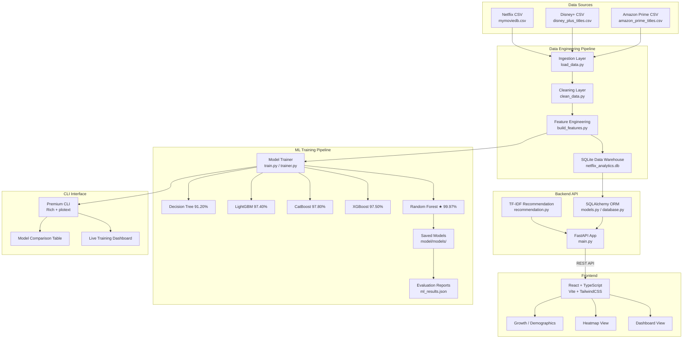

# Architecture

This document describes the complete system architecture of the Netflix AI Analytics Platform.

---

## Overview

The platform is a multi-tier, full-stack analytics system that aggregates streaming catalog data from Netflix, Disney+, and Amazon Prime, processes it through a data engineering pipeline, applies machine learning models, and serves insights through both a web dashboard and a CLI interface.

---

## System Architecture Diagram



---

## Component Details

### Data Engineering Layer

| Component | File | Responsibility |
|-----------|------|----------------|
| Ingestion | `model/ingestion/load_data.py` | Load raw CSVs using Polars |
| Cleaning | `model/cleaning/clean_data.py` | Handle nulls, duplicates, type normalization |
| Feature Engineering | `model/feature_engineering/build_features.py` | Encode genres, scale numerics, create ML features |
| Data Warehouse | `model/analytics.db` | SQLite unified schema for all 20,946 titles |

### Machine Learning Layer

| Component | File | Responsibility |
|-----------|------|----------------|
| Train Entry Point | `model/train.py` | Orchestrates all training stages |
| Model Trainer | `model/trainer.py` | Rich CLI training loop with live metrics |
| Metrics | `model/metrics.py` | Accuracy, precision, recall, F1 calculation |
| Logger | `model/logger.py` | Session log recording |
| Graphs | `model/graphs.py` | ASCII training curve generation |
| Config | `model/config.py` | Centralized hyperparameters and paths |

### Backend API Layer

| Component | File | Responsibility |
|-----------|------|----------------|
| API App | `deployment/backend/main.py` | FastAPI app, 12+ endpoints |
| Database | `deployment/backend/database.py` | SQLAlchemy engine and session |
| Models | `deployment/backend/models.py` | ORM movie schema |
| Recommendations | `deployment/backend/recommendation.py` | TF-IDF cosine similarity engine |

### Frontend Layer

| Component | File | Responsibility |
|-----------|------|----------------|
| App Root | `deployment/frontend/src/App.tsx` | State management, routing |
| Dashboard | `src/components/DashboardView.tsx` | Main data visualization panels |
| Header | `src/components/Header.tsx` | AI-powered search |
| Sidebar | `src/components/Sidebar.tsx` | Navigation and data source selector |
| Server | `deployment/frontend/server.ts` | Express + Vite dev server with Gemini AI |

---

## Data Flow

```
Raw CSV Files
    ↓ (Polars fast read)
Ingestion Layer
    ↓ (null handling, deduplication, type casting)
Cleaning Layer
    ↓ (genre encoding, TF-IDF, scaling, train/test split)
Feature Engineering
    ↓
┌─────────────────────────────────┐
│     Training Pipeline           │
│  Random Forest / XGBoost / etc  │
│  Rich CLI + ASCII plots         │
└─────────────────────────────────┘
    ↓ (model.pkl + ml_results.json)
FastAPI Backend
    ↓ (REST endpoints)
React Frontend + CLI Dashboard
```

---

## Technology Stack Summary

| Layer | Technology |
|-------|------------|
| Data Processing | Polars, Pandas, NumPy |
| Machine Learning | Scikit-learn, XGBoost, CatBoost, LightGBM |
| ML Explainability | SHAP (planned) |
| Backend Framework | FastAPI 0.111, Uvicorn |
| ORM | SQLAlchemy 2.0 |
| Database | SQLite (development), PostgreSQL (production roadmap) |
| Frontend Framework | React 18, TypeScript, Vite |
| UI Styling | TailwindCSS, Framer Motion |
| CLI Interface | Rich, plotext, colorama, alive-progress |
| AI Integration | Google Gemini API |
| Containerization | Docker, Docker Compose |
| CI/CD | GitHub Actions |
| Code Quality | Ruff, Black, MyPy, pre-commit |
